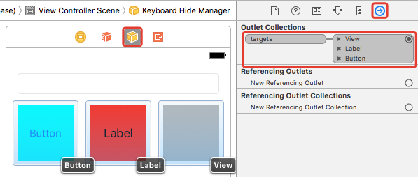
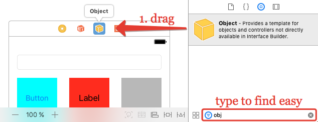
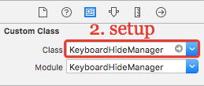
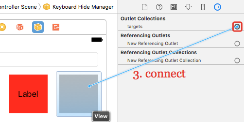
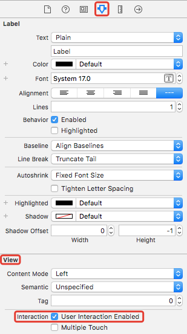

# KeyboardHideManager


[](https://developer.apple.com/swift/)
[](https://cocoapods.org/)
[](http://cocoadocs.org/docsets/KeyboardHideManager)
[](http://mit-license.org/)

**KeyboardHideManager** - easy to use, codeless manager to hide keyboard by tapping on views for iOS written in Swift.



## Structure

- [Features](#features)
- [Requirements](#requirements)
- [Installation](#installation)
	- [CocoaPods](#cocoapods)
	- [Carthage (not supported)](#carthage-not-supported)
	- [Manually](#manually)
- [Usage](#usage)
- [User Iteraction Enabled](#user-iteraction-enabled)
- [Code usage](#code-usage)
- [Xib support](#xib-support)
- [To do](#to-do)
- [License](#license)

## Features

- [x] 3 simple actions to setup
- [x] Multiple views setup
- [x] Codeless usage
- [x] Xib support

## Requirements

- Swift 3.0+
- iOS 8.0+

## Installation

### CocoaPods

```ruby
pod 'KeyboardHideManager', '~> 1.0'
```

<details>
<summary>Full CocoaPods Guide (click to expand)</summary>

[CocoaPods](http://cocoapods.org) is a dependency manager for Cocoa projects. You can install it with the following command:

```bash
$ gem install cocoapods
```

To integrate KeyboardHideManager into your Xcode project using CocoaPods, create file `Podfile` with content:

```ruby
platform :ios, '9.0'
use_frameworks!

target '<Your Target Name>' do
    pod 'KeyboardHideManager', '~> 1.0'
end
```

Then, run the following command:

```bash
$ pod install
```

Close 'Your Target Name'.**xcodeproj** and open 'Your Target Name'.**xcworkspace**.

</details>

### Carthage (not supported)

KeyboardHideManager cannot be used in IB due `.framework` issue. Use CocoaPods or Manual install.

### Manually

> If you prefer not to use either of the aforementioned dependency managers, you can integrate KeyboardHideManager into your project manually.

Drag `KeyboardHideManager` folder in your project.

## Usage

- 1. Drag Object from Object library



- 2. Setup `KeyboardHideManager` in Class field



 - 3. Connect views with `targets`



## User Iteraction Enabled

Target must be `UIView` subclass and `user iteraction enabled` is on. You can set it in IB in View section: (example for UILabel)



or in code:

```swift
someView.isUserInteractionEnabled = true
```

## Xib support

To use with xib you must add strong property to controller:

```swift
@IBOutlet var keyboardHideManager: KeyboardHideManager!
```

> Otherwise it will be deinited. It is logic of Objects in xibs.

## To do

- [x] Add example
- [x] Add tests
- [x] Add comments
- [ ] Add CI

## License

KeyboardHideManager is released under the MIT license. See [LICENSE](./LICENSE.md) for details.